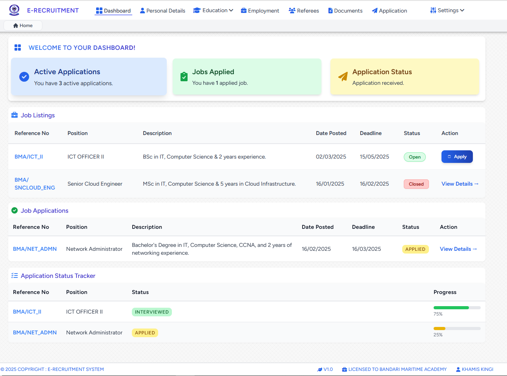
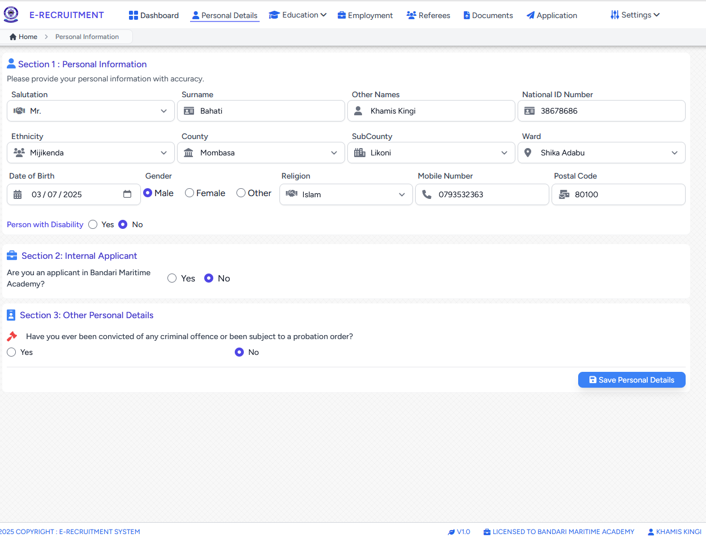
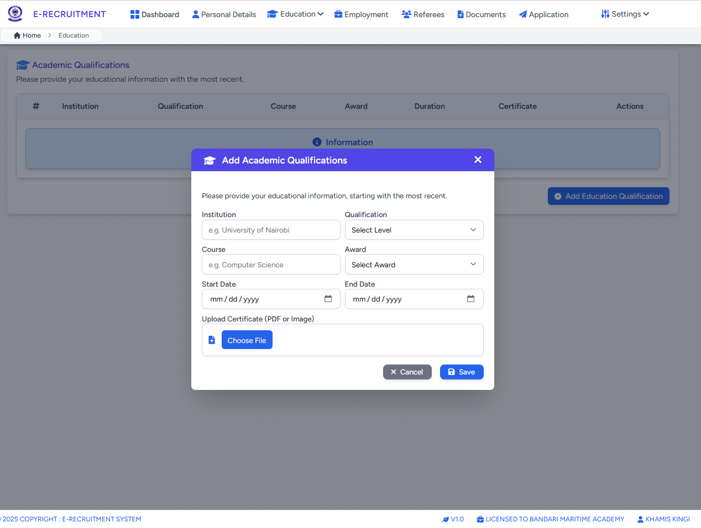
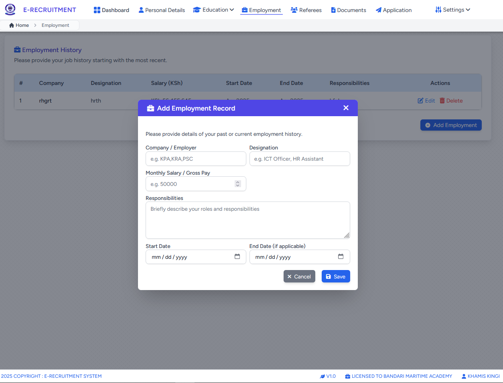
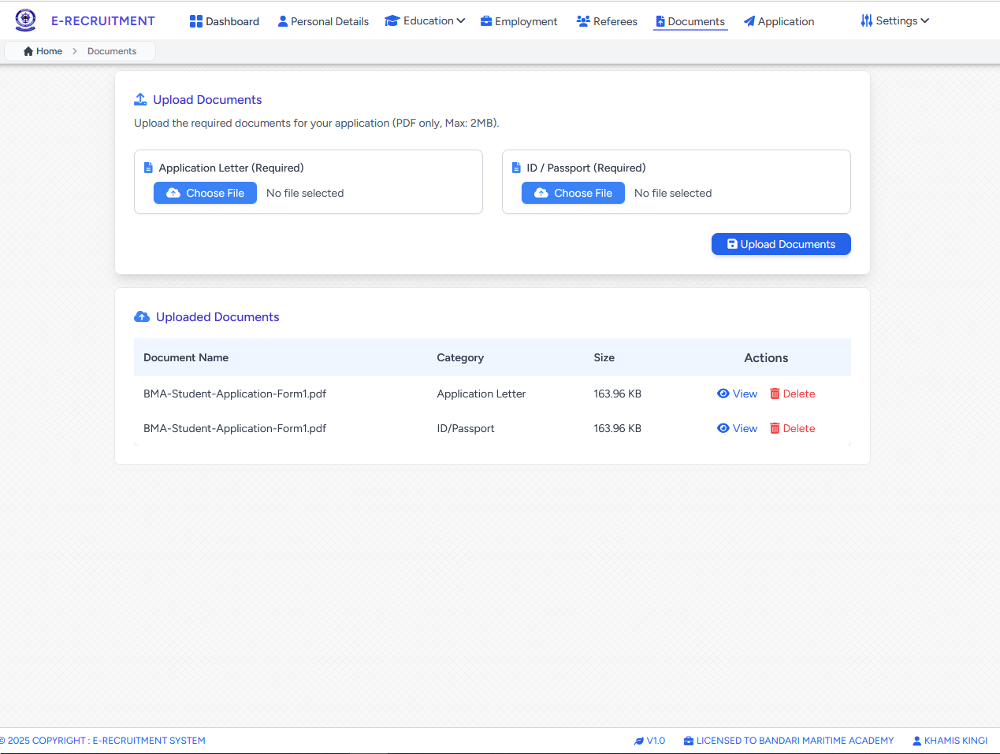
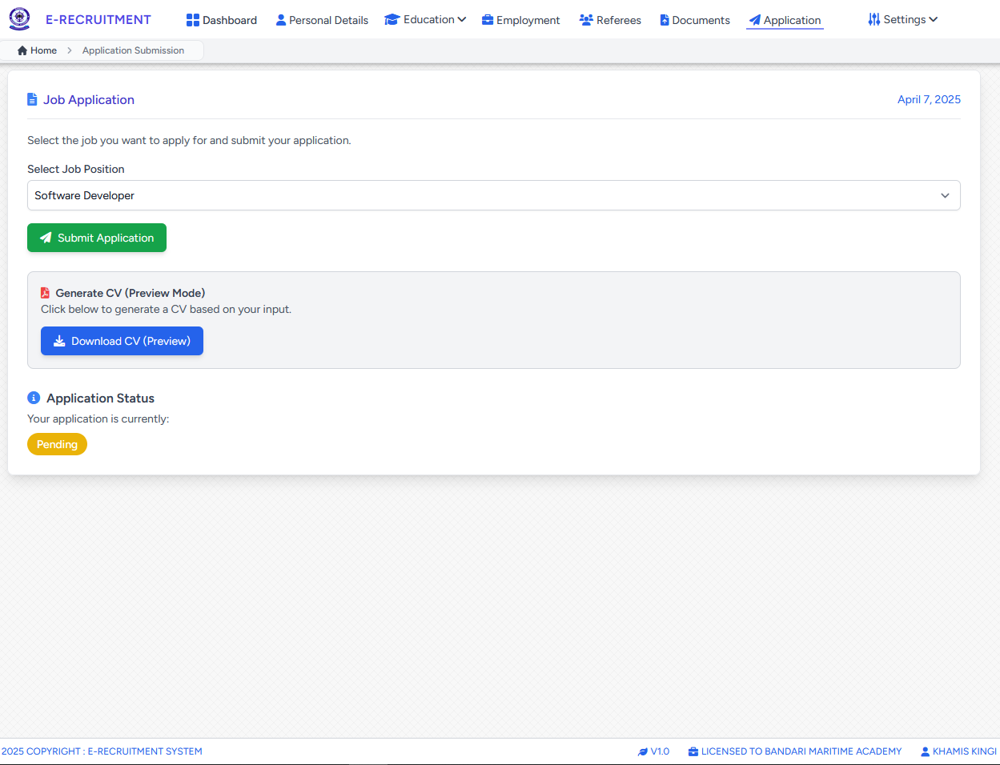

# Job Application Portal

## Overview

The **Job Application Portal** is a web-based platform designed to streamline the job application process. It allows users to create profiles, add their educational background, manage personal information, and apply for job opportunities. The portal is built using **Laravel** and **Tailwind CSS** for a modern and responsive user experience.


## Technology Stack

- **Backend:** Laravel 11 (Breeze Authentication + OTP)
- **Frontend:** Tailwind CSS, Alpine.js
- **Database:** MySQL
- **Version Control:** Git & GitHub
- **Deployment:** Laravel Forge / DigitalOcean (Planned)

## Installation & Setup

### 1️⃣ Clone the Repository

```sh
    git https://github.com/kingi001/career-portal.git
    cd career-portal
```

### 2️⃣ Install Dependencies

```sh
    composer install
    npm install
```

### 3️⃣ Setup Environment Variables

```sh
    cp .env.example .env
    php artisan key:generate
```

### 4️⃣ Configure Database

Update `.env` file with your database credentials:

```env
DB_CONNECTION=mysql
DB_HOST=127.0.0.1
DB_PORT=3306
DB_DATABASE=your_db_name
DB_USERNAME=your_db_user
DB_PASSWORD=your_db_password
```

Then run:

```sh
    php artisan migrate
```

### 5️⃣ Run the Application

```sh
    php artisan serve
```
### 5️⃣ Run the Application

```sh
    npm run dev
```

Then open `http://127.0.0.1:8000` in your browser.

## Screenshots 








## Future Enhancements

- Implement job application workflow
- Add an admin panel for job posting management
- Improve UI/UX with better responsiveness

## Contributing

Contributions are welcome! Please follow these steps:

1. Fork the repository
2. Create a new branch (`feature/your-feature`)
3. Commit changes and push to GitHub
4. Submit a pull request

---
🚀 **Developed by khamis kinigi** 

